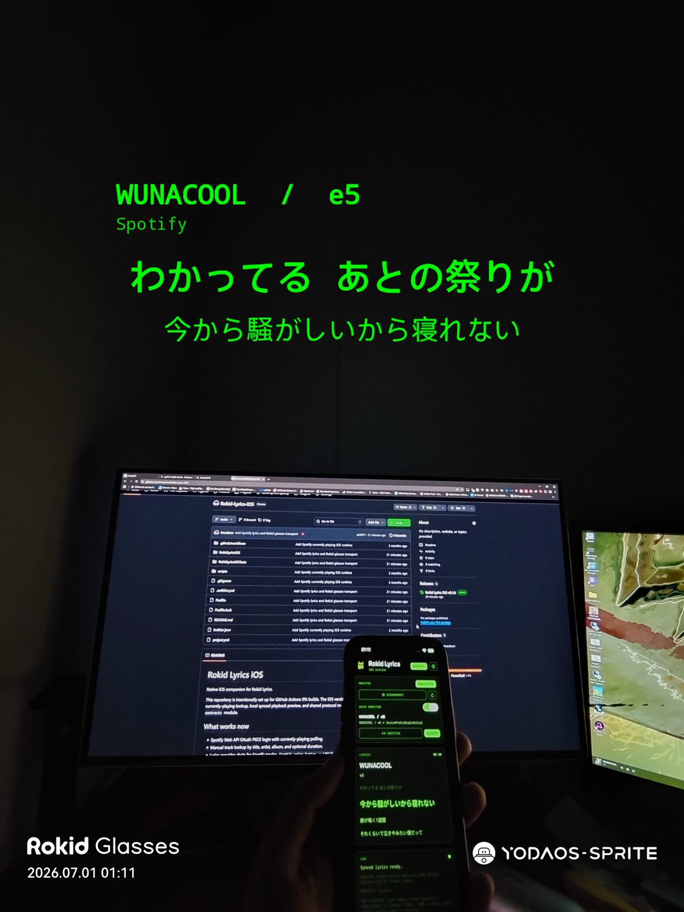
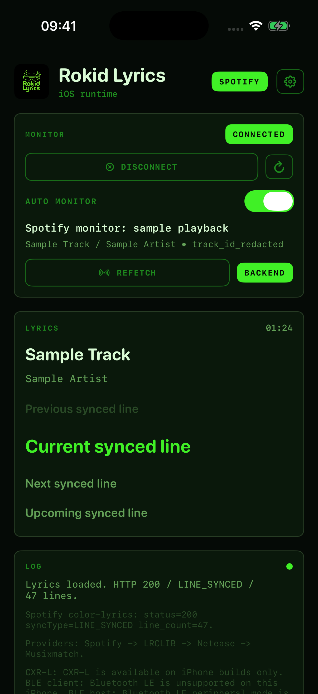
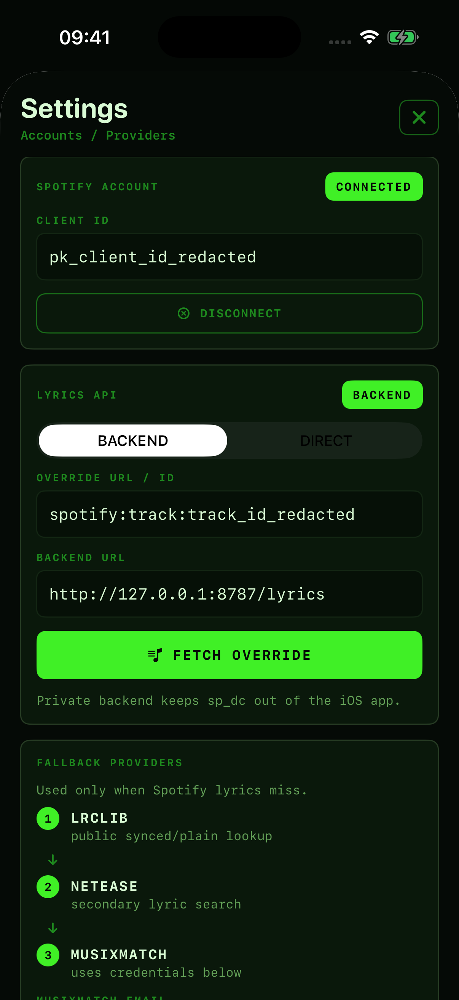
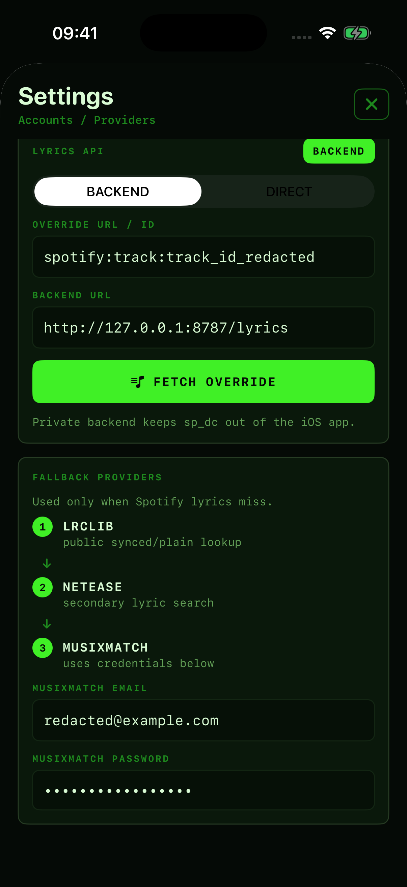

<p align="center">
  
</p>

<h1 align="center">Rokid Lyrics iOS</h1>

<p align="center">
  Native iOS companion for Rokid Lyrics.
</p>

<p align="center">
  <a href="https://ko-fi.com/M8R61ZTXMI" target="_blank">
    
  </a>
</p>

---

This repository is intentionally set up for GitHub Actions IPA builds. The iOS version is a SwiftUI companion with Spotify currently-playing lookup, local synced playback preview, and shared protocol models that mirror the Android `shared-contracts` module.

## Screenshots

<p align="center">
  
</p>
<p align="center">
  <em>Rokid Glasses live lyrics display with the iPhone companion.</em>
</p>

Redacted simulator captures. The displayed client ID, track ID, email, and provider credentials are placeholders.

| Runtime | Settings | Providers |
| --- | --- | --- |
|  |  |  |

## What works now

- Spotify Web API OAuth PKCE login with currently-playing polling.
- Manual track lookup by title, artist, album, and optional duration.
- Lyrics provider chain for Spotify tracks: `Spotify color-lyrics -> LRCLIB -> Netease -> Musixmatch`.
- Manual title/artist lookup still uses `LRCLIB -> Netease -> Musixmatch`.
- Local timeline controls for play, pause, restart, and scrub.
- Swift models for the Android wire protocol (`snapshot`, `sync`, status, hello/ack).
- Rokid CXR-L client integration via CocoaPods `RGCxrClient`.
- GitHub Actions unsigned, resignable, and optional signed IPA artifacts.

## iOS constraint

iOS does not expose a system-wide media-session listener like Android notification access. Spotify support therefore uses Spotify's Web API after the user connects a Spotify account. This works for private/beta use, but Spotify Development Mode is limited to allowlisted users.

## Spotify setup

### Getting a Spotify Client ID

The iOS app uses Spotify Web API OAuth with PKCE, so it needs a Spotify Client ID but no Client Secret.

1. Open the Spotify Developer Dashboard: `https://developer.spotify.com/dashboard`.
2. Log in with your Spotify account.
3. Click `Create app`.
4. Enter an app name and description, for example `Rokid Lyrics iOS`.
5. Select `Web API` when Spotify asks which APIs you plan to use.
6. Add this Redirect URI:

```text
rokidlyrics://spotify-callback
```

7. If Spotify asks for an iOS Bundle ID, use the bundle ID of the build you are signing. The default project bundle ID is:

```text
com.anezium.rokidlyrics
```

8. Save the app.
9. Open the app's `Settings` page in the Spotify dashboard.
10. Copy the `Client ID`.
11. Paste that Client ID into Rokid Lyrics iOS `Settings` -> `Spotify Account` -> `Client ID`.
12. Tap `Connect` in Rokid Lyrics iOS and finish the Spotify login.

Do not paste the Spotify Client Secret into the iOS app. This app does not use it, and mobile apps cannot safely keep a client secret private.

Spotify apps start in Development Mode. If another Spotify account needs to use your app, add it in the Spotify dashboard under `Settings` -> `Users Management`; otherwise Spotify API calls for that account can fail with `403`.

## Spotify lyrics source

The app has a separate `SPOTIFY LYRICS` panel for synced lyrics. The normal flow uses the existing Spotify Web API integration: connect Spotify, keep `MONITOR` enabled, and let the app read the currently playing track automatically. When the Spotify track changes, the current track ID from the now-playing payload is passed into the lyrics provider chain without requiring a manual fetch. `REFETCH CURRENT SPOTIFY` and the URL/ID field are manual debug/override paths.

### Getting `sp_dc`

Recommended path: use a desktop browser and keep this value private. `sp_dc` is an account session cookie, not a Spotify OAuth token.

Chrome / Brave / Edge on desktop:

1. Open `https://open.spotify.com/` and log in with your own Spotify account.
2. Open DevTools with `Cmd+Option+I` on macOS, or `F12` / `Ctrl+Shift+I` on Windows.
3. Go to `Application` -> `Storage` -> `Cookies` -> `https://open.spotify.com`.
4. Filter for `sp_dc`.
5. Copy only the `Value` column for `sp_dc`.
6. Paste it into your private backend config, or into iOS `Settings` -> `Lyrics API` -> `Direct` -> `SP_DC` for full-local testing.

The iOS field accepts the raw value, `sp_dc=...`, or a full `Cookie: sp_dc=...` header and normalizes it before storing it in Keychain.

If `sp_dc` is missing, refresh `open.spotify.com`, log out and back in, then re-check the same Cookies table. If the app reports an anonymous token, the cookie is stale or from a logged-out web session; refresh it from a logged-in Spotify web session.

On iPhone, there is no normal Spotify app or Spotify OAuth flow that exposes `sp_dc`. iOS Chrome/Safari also do not provide a simple cookie-value viewer in the browser UI. Do not try to pull it from the Spotify iOS app, jailbreak, MITM, or sandbox bypasses. A random website cannot safely extract it either: browser same-origin rules and `HttpOnly` cookies prevent a site from reading Spotify cookies. Use a desktop browser, then paste the value manually into the backend or the app.

Modes:

- `Backend`: recommended for prototypes. Run a private backend at the configured base URL. The app calls `GET {baseURL}/{trackId}` and expects either Spotify's raw `color-lyrics/v2` JSON or a wrapper with `lyrics.syncType` and `lyrics.lines`. The backend owns `sp_dc`, refreshes the bearer token through `https://open.spotify.com/api/token`, and calls `https://spclient.wg.spotify.com/color-lyrics/v2/track/{trackId}?format=json&market=from_token`.
- `Direct`: full local iOS mode. Paste your own `sp_dc` into the secure field. The value is stored in iOS Keychain only, then used to fetch a short-lived bearer token and Spotify color-lyrics JSON directly from the app. The Spotify OAuth login does not expose `sp_dc`; it is only used for currently-playing metadata.

Safety rules:

- Never hardcode `sp_dc`.
- Never commit `sp_dc`, bearer tokens, cookies, or request headers.
- Do not log secrets. The app logs only HTTP status, content type, `syncType`, token length, and line count.
- Do not extract `sp_dc` from Spotify iOS, jailbreak, MITM, or sandbox bypasses. The user must provide their own cookie explicitly.
- Spotify `spclient` and `color-lyrics` are internal APIs. They can change without notice and their use may violate Spotify terms, so keep this path private/prototype-only.

The current Rokid iOS SDK exposed by `RGCxrClient` provides `openCustomView/updateCustomView` and `sendCustomCmd`, but no dedicated subtitle API. This prototype keeps the existing custom-app helper path: iOS sends lyric snapshots/windows/sync over CXR-L custom commands or BLE, and the glasses helper owns text layout.

## Build

The project uses XcodeGen plus CocoaPods:

```bash
xcodegen generate
pod install
open RokidLyricsIOS.xcworkspace
```

The workflow builds on `macos-15` with XcodeGen:

```bash
xcodegen generate
pod install
xcodebuild -workspace RokidLyricsIOS.xcworkspace -scheme RokidLyricsIOS -configuration Release -sdk iphoneos -destination generic/platform=iOS CODE_SIGNING_ALLOWED=NO build
```

From Windows, `builder-windows-amd64.exe` can trigger GitHub Actions:

```powershell
.\builder-windows-amd64.exe ios build --unsigned
```

## Signing

Local signing files are intentionally ignored by Git:

- `.signing/`
- `Developer/`
- `Distribution/`
- `*.p12`
- `*.mobileprovision`
- `builder*.exe`

Use `scripts/Set-GitHubSigningSecrets.ps1` to upload signing material into GitHub Secrets for this repo.

The workflow also accepts the secret names created by `builder signing setup`, but a `BUNDLE_ID` secret is still required so the generated Xcode project matches the provisioning profile.
